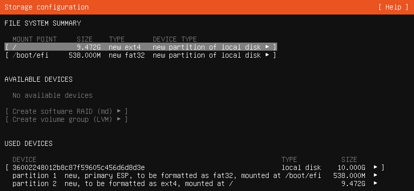

# Initial Image — Hyper-V VM with Ubuntu 24.04 Server

The starting image is built inside a Hyper-V VM running Ubuntu Server, then captured and fed to `mender-convert`. The VM hardware and partition layout must satisfy the constraints in [`mender-convert/configs/generic_x86-64_hdd_config`](mender-convert/configs/generic_x86-64_hdd_config): x86_64, UEFI boot, classic (non-LVM) partitioning with `/boot/efi` and `/`.

Ubuntu Server is the documented path here because it's the most familiar Debian-family server distro for general Linux users. Other base images (Debian, CentOS, etc.) can be substituted later — `mender-convert` supports any Debian-family image, and the generic x86-64 config has been tested against CentOS as well.

## 1. Create the VM (Hyper-V "New Virtual Machine" wizard)

| Step | Setting | Value |
| :--- | :------ | :---- |
| Specify Generation | Generation | **Generation 2** (required for UEFI) |
| Assign Memory | Startup memory | **4096 MB**, dynamic memory enabled |
| Configure Networking | Connection | **Default Switch** (provides NAT for `apt`) |
| Connect Virtual Hard Disk | Action | **Create a new virtual hard disk** |
| Connect Virtual Hard Disk | Format / size | **VHDX, 10 GB** |
| Installation Options | Source | **Install an operating system later** |

The 10 GB disk matches the "10G or desired size" recommendation in the generic x86-64 config and leaves headroom inside the 16 GB target image that `mender-convert` produces (boot + 2× rootfs A/B + data).

> **Why no LVM and only two partitions?** `mender-convert` rewrites the partition table to add a second rootfs (A/B for atomic updates) and a persistent data partition. It expects to find the source root filesystem on a plain partition, not inside an LVM logical volume.

## 2. Adjust VM settings before first boot

In the VM's settings:

- **Security → disable Secure Boot.** The default Generation 2 template uses the Microsoft UEFI CA, which blocks the stock Ubuntu installer from booting. Disabling it is the simplest path; you can re-enable Secure Boot later with a custom signing setup if needed.
- **DVD Drive → attach the Ubuntu 24.04 Server ISO.** Download from <https://ubuntu.com/download/server> if you don't already have it. Ensure the DVD is ahead of the hard disk in the firmware boot order (Settings → Firmware) so the installer boots first.

## 3. Install Ubuntu Server

Boot the VM. The Ubuntu Server installer (Subiquity) walks through standard prompts — language, keyboard, network, mirror, profile, SSH. The two steps that matter for `mender-convert` compatibility:

### Storage layout

When the installer reaches **"Guided storage configuration"**, pick **"Custom storage layout"**. The guided default uses LVM, which `mender-convert` cannot consume.

In the custom layout, create exactly two partitions on the 10 GB disk:

| Partition | Size | Type | Mount | Notes |
| :-------- | :--- | :--- | :---- | :---- |
| 1 | 512 MB | FAT32 | `/boot/efi` | Mark as ESP / boot flag |
| 2 | rest of disk | ext4 | `/` | |

Do **not** create a swap partition, and do **not** create any LVM volume groups. A swap file on the root filesystem is fine if you want swap; it doesn't affect partitioning.

When the storage configuration screen looks like the screenshot below — exactly two partitions, no volume groups, no swap — you're ready to continue:



### SSH

Enable **"Install OpenSSH server"** on the profile screen. You'll need SSH access later to capture the disk image and to verify Mender updates.

Reboot when the install completes and log in once to confirm everything works.

## 4. Decide what goes in the golden image

The golden image is the OS layer only. Anything that should change at a different cadence — applications, configuration tied to a specific device, persistent data — does NOT belong here.

| Belongs in the golden image | Lives elsewhere |
| :-- | :-- |
| Kernel, system libraries, container runtime (Docker Engine + compose plugin) | Application containers (delivered via Mender's docker-compose update module to `/data/...`) |
| systemd units, networking, SSH config, NTP, log rotation | Application state, databases, captured data (data partition, mounted at `/data`) |
| Mender client and update modules | Per-device identity — UUIDs, certificates, customer config (provisioned at first boot) |

The principle: anything in the rootfs gets atomically replaced when an OS update lands on the inactive A/B slot. If a byte should survive that swap, it must live on the data partition — the fourth partition `mender-convert` carves out, which `MENDER_DATA_PART_GROWFS=y` will expand on first boot to fill whatever's left on the device's storage.

This sets up a two-tier update model on the converted device:

- **OS-layer updates** — full rootfs artifacts produced by `mender-convert`. Atomic, rollback-able, infrequent.
- **App-layer updates** — Mender docker-compose deployments that touch `/data/compose/...` and pull new container images. Frequent.

**If you'll use Docker for app delivery** (the planned path for this project), do these inside the running VM before extraction:

1. Install Docker Engine and the compose plugin from Docker's official apt repository — not the snap.
2. Configure Docker to keep its data root on the persistent partition so pulled images and volumes survive OS updates:
   ```bash
   sudo mkdir -p /etc/docker
   echo '{"data-root": "/data/docker"}' | sudo tee /etc/docker/daemon.json
   ```
   `/data` doesn't exist in the golden — `mender-convert` creates it. Docker will start cleanly against the empty data partition on first boot of the converted image.
3. Add a systemd unit that runs `docker compose up -d` against `/data/compose/docker-compose.yml` on boot, so the eventual app stack starts unattended once a deployment lands.
4. Plan to set `MENDER_DOCKER_COMPOSE_INSTALL="y"` in your `mender-convert` config — it defaults to `"n"` per [`mender_convert_config:159`](mender-convert/configs/mender_convert_config:159). This adds the docker-compose update module to the converted image, which is what receives the app-layer deployments.

Don't pre-pull application container images into the rootfs — they'd be wiped on the first OS update. Base images you pull at runtime end up under `/data/docker/` (per the `daemon.json` above) and persist correctly.

## 5. Capture the disk as a raw image

`mender-convert` consumes a **raw partitioned disk image** — a byte-for-byte copy of the entire disk, including the GPT partition table, ESP, and root filesystem, written to a single file (typical extensions `.img` or `.raw`). It does not consume virtual-disk container formats (VHDX, VMDK, qcow2, VDI) or live filesystems.

How you produce that file depends on where you built the golden:

- **Real hardware** — boot a live USB and `dd` the source disk to a file on external storage. The [comments at the top of `generic_x86-64_hdd_config`](mender-convert/configs/generic_x86-64_hdd_config) walk through the canonical recipe.
- **Virtual machines** — shut the guest down cleanly, then convert the virtual-disk container to raw. `qemu-img convert -O raw <input> <output.img>` handles all common formats (VHDX, VMDK, qcow2, VDI).

Regardless of source, the resulting file must be:

- A capture of the **whole disk**, not a single partition.
- Taken from a **quiesced filesystem** — always shut the source system down cleanly first; never snapshot a running OS.
- Accessible to the Linux host that will run `mender-convert`, on a native Linux filesystem if possible. Network mounts and emulated filesystems can cause loopback or ownership errors per the [mender-convert README](mender-convert/README.md).

## Final artifact (chapter done state)

This chapter is complete when:

- [ ] A raw disk image file exists at a known path on the host that will run `mender-convert`.
- [ ] It was captured from a cleanly shut down system.
- [ ] It contains a GPT partition table with exactly two partitions — an ESP at the start, an ext4 root filling the rest. Verify with:
   ```bash
   sgdisk --print path/to/golden.img
   # or
   sudo fdisk -l path/to/golden.img
   ```
- [ ] If you took the Docker delivery path, Docker Engine and the compose plugin are present in the rootfs, and `/etc/docker/daemon.json` sets `data-root` to `/data/docker`.

That image is the input to chapter 02, where `mender-convert` reshapes it into a Mender-compatible image with the A/B rootfs layout, persistent data partition, and Mender client baked in.
